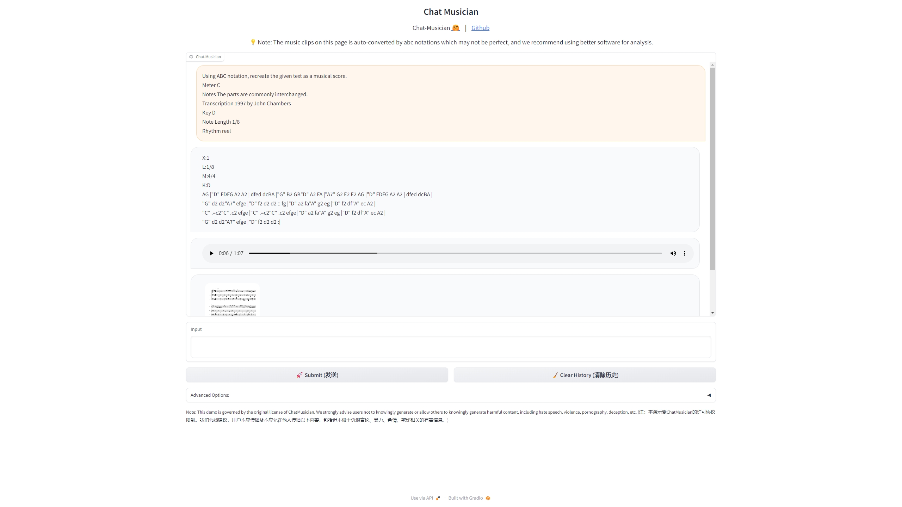

# 🎼 ChatMusician: Understanding and Generating Music Intrinsically with LLM

[**🌐 DemoPage**](https://ezmonyi.github.io/ChatMusician/) |  [**🤗 Pretrain Dataset**](https://huggingface.co/datasets/m-a-p/MusicPile) | [**🤗 SFT Dataset**](https://huggingface.co/datasets/m-a-p/MusicPile-sft) | [**🤗 Benchmark**](https://huggingface.co/datasets/m-a-p/MusicTheoryBench) | [**📖 arXiv**](http://arxiv.org/abs/2402.16153) | [💻 **Code**](https://github.com/hf-lin/ChatMusician) | [**🤖 Chat Model**](https://huggingface.co/m-a-p/ChatMusician) | [**🤖 Base Model**](https://huggingface.co/m-a-p/ChatMusician-Base)

## 🔔News
- **🔥[2023-12-10]: The release of ChatMusician's demo, code, model, data, and benchmark. 😆**
- [2023-11-30]: Checkout another awesome project [MMMU](https://huggingface.co/datasets/MMMU/MMMU/) that includes multimodal music reasoning.

## Introduction

While Large Language Models (LLMs) demonstrate impressive capabilities in text generation,
we find that their ability has yet to be generalized to music, humanity’s creative language.
We introduce **ChatMusician**, **an open-source LLM that integrates intrinsic musical abilities**.

It is based on continual pre-training and finetuning LLaMA2 on a text-compatible music representation, ABC notation, and the music is treated as a second language. ChatMusician can understand and generate music with a pure text tokenizer without any external multi-modal neural structures or tokenizers. Interestingly, endowing musical abilities does not harm language abilities, even achieving a slightly higher MMLU score. Our model is capable of composing well-structured, full-length music, conditioned on texts, chords, melodies, motifs, musical forms, etc, surpassing GPT-4 baseline. On our meticulously curated college-level music understanding benchmark, MusicTheoryBench, ChatMusician surpasses LLaMA2 and GPT-3.5 on zero-shot setting by a noticeable
margin. Our work reveals that LLMs can be an excellent compressor for music, but there remains significant territory to be conquered. Code, data, model, and benchmark are open-sourced. 

## Training Data

ChatMusician is pretrained on the 🤗 [MusicPile](https://huggingface.co/datasets/m-a-p/MusicPile), which is the first pretraining corpus for **developing musical abilities** in large language models. Check out the dataset card for more details.
And supervised finetuned on 1.1M samples(2:1 ratio between music knowledge & music summary data and music scores) from MusicPile. Check our [paper](http://arxiv.org/abs/2402.16153) for more details.

## Training Procedure

We initialized a fp16-precision ChatMusician-Base from the LLaMA2-7B-Base weights, and applied a continual pre-training plus fine-tuning pipeline. LoRA adapters were integrated into the attention and MLP layers, with additional training on embeddings and all linear layers. The maximum sequence length
was 2048. We utilized 16 80GB-A800 GPUs for one epoch pre-training and 8 32GB-V100 GPUs for two epoch fine-tuning. DeepSpeed was employed for memory efficiency, and the AdamW optimizer was used with a 1e-4 learning rate and a 5% warmup cosine scheduler. Gradient clipping was set at 1.0. The LoRA parameters dimension, alpha, and
dropout were set to 64, 16, and 0.1, with a batch size of 8.

## Evaluation

1. Music understanding abilities are evaluated on the [MusicTheoryBench](https://huggingface.co/datasets/m-a-p/MusicTheoryBench). Check out `eval` folder for more details.
2. General language abilities of ChatMusician are evaluated on the [Massive Multitask Language Understanding (MMLU) dataset](https://huggingface.co/datasets/lukaemon/mmlu).


## Requirements

- Python 3.8 and above
- Pytorch 2.0 and above are recommended
- CUDA 11.4 and above are recommended
- Deepspeed 0.10 and above are recommended

Python dependency installation:
```
pip install -r requirements.txt 
```

## Inference

### web demo (with audio)

To render audio in real-time, you must install abcmidi and MuseScore.

1. Install abc2midi.
```
sudo apt-get update
sudo apt-get install abcmidi
```

2. Install MuseScore([on Linux](https://musescore.org/en/handbook/3/install-linux), [on Mac](https://musescore.org/en/handbook/3/install-macos), [on Windows](https://musescore.org/en/handbook/3/install-windows)).
  

Then launch a gradio demo:

```bash
cd ChatMusician/
python model/infer/chatmusician_web_demo.py -c "m-a-p/ChatMusician" --server_port 8888
```

Prompt example:
```
Using ABC notation, recreate the given text as a musical score.
Meter C
Notes The parts are commonly interchanged.
Transcription 1997 by John Chambers
Key D
Note Length 1/8
Rhythm reel
```


### inference locally

```bash
cd Chat-Musician/
python model/infer/predict.py --base_model {merged_model_path} --with_prompt --interactive
```
Note: with `--with_prompt`, input text will be converted to chat format.

## Start an Experiment

### SFT Data Format

Our SFT dataset comprises data points structured with three main features: `instruction`, `input`, and `output`. Each data point resembles a conversation between a human and an assistant, formatted as follows: `Human: {...} </s> Assistant: {...} </s>. `

For example,

    {
    "instruction": "Construct melodies by blending the designated musical pattern with the supplied motif.",
    "input": "['Binary', 'Sectional: Verse/Chorus'];X:1 L:1/16 M:2/4 K:G ['G2BG A2cA B2dB', '(gf)(ge) (ed)(cB)' </s> ",
    "output": "Assistant: X:1 L:1/16 M:2/4 K:G G2BG A2cA | B2dB G2B2 | c2ec B2dB | ABAG (GF)(ED) | G2BG A2cA | B2dB c2ec | cBAG D2f2 | g2d2B2G2 || (gf)(ge) (ed)(cB) | (gf)(ge) (ed)(cB) | ca2c Bg2B | ABAG GFED | G2BG A2cA | cBAG d2f2 | g2d2B2G2 || </s> "
    }
    

You can explore more samples at [MusicPile-sft](https://huggingface.co/datasets/m-a-p/MusicPile-sft). We recommend structuring your data in a similar format for fine-tuning based on ChatMusician-Base.

### Data Preprocessing

Data preprocessing involves converting texts into token IDs, which helps save GPU memory compared to runtime tokenization.

```bash
cd ChatMusician
## specify `--tokenize_fn pt` for preprocessing continual pretrain data
## specify `--tokenize_fn sft` for preprocessing sft data
python model/train/data_preprocess.py \
    -t $TOKENIZER_PATH \
    -i $DATA_FILE \
    -o $OUTPUT_DIR 
```
For example, if you're using `m-a-p/ChatMusician-Base` and the dataset `m-a-p/MusicPile-sft` for supervised fine-tuning, and want to save preprocessed data in the `datasets` directory:
```bash
python model/train/data_preprocess.py \
    -t m-a-p/ChatMusician-Base \
    -i m-a-p/MusicPile-sft \
    -o datasets \
    --tokenize_fn sft 
```

### Pretraining or Supervised Fine-tuning

run `model/train/scripts/train.sh $PREPROCESSED_DATASET_PATH $YOUR_MODEL_PATH`

For example, if you're fine-tuning based on `m-a-p/ChatMusician-Base` for supervised fine-tuning and your data file has been preprocessed in the `datasets` directory:
```bash
./model/train/scripts/train.sh datasets m-a-p/ChatMusician-Base
```
You can then find the tensorboard log in the `runs` directory.

## Merge Peft Model

After finetuning,  you can merge the LoRa checkpoint with the original checkpoint using the following script:
```bash
cd ChatMusician/
python model/train/merge.py --ori_model_dir $BASE_MODEL --model_dir $LORA_CKPT_PATH --output_dir $OUTPUT_PATH
```

## Limitations

- ChatMusician currently only supports strict format and close-ended instructions for the music tasks. If we have more funding, we plan to create a more diverse multi-turn music instruction chat data for better generalization.
- ChatMusician suffers from hallucinations, and shouldn't be used for music education. It could be improved by feeding more music textbooks, blogs, etc. And RLHF may help, too.
- A large portion of the training data is in the style of Irish music. If possible, the community should develop a converter between performance midi and ABC scores, so that we can include more established midi datasets.
- The MusicThoeryBench results reported in the paper are obtained with perplexity mode. Direct generation may result in a worse performance.
- We observe that using the current version of training data, ChatMusician presents a weak in-context-learning and chain-of-thoughts ability. The community should work on improving the music data quality. 


## Citation
If you find our work helpful, feel free to give us a cite.
```
@misc{yuan2024chatmusician,
      title={ChatMusician: Understanding and Generating Music Intrinsically with LLM}, 
      author={Ruibin Yuan and Hanfeng Lin and Yi Wang and Zeyue Tian and Shangda Wu and Tianhao Shen and Ge Zhang and Yuhang Wu and Cong Liu and Ziya Zhou and Ziyang Ma and Liumeng Xue and Ziyu Wang and Qin Liu and Tianyu Zheng and Yizhi Li and Yinghao Ma and Yiming Liang and Xiaowei Chi and Ruibo Liu and Zili Wang and Pengfei Li and Jingcheng Wu and Chenghua Lin and Qifeng Liu and Tao Jiang and Wenhao Huang and Wenhu Chen and Emmanouil Benetos and Jie Fu and Gus Xia and Roger Dannenberg and Wei Xue and Shiyin Kang and Yike Guo},
      year={2024},
      eprint={2402.16153},
      archivePrefix={arXiv},
      primaryClass={cs.SD}
}
```
